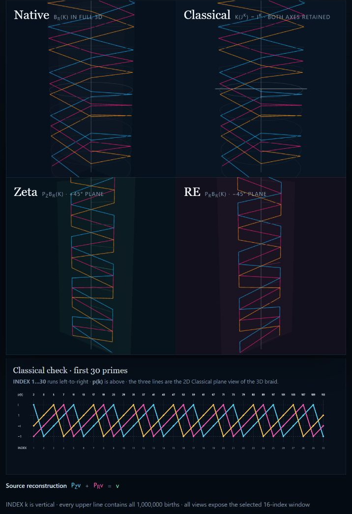

<!-- SPDX-License-Identifier: CC-BY-SA-4.0 -->

# Native Space

Native Space begins with a very small question:

> What does an ordinary number stop telling us after we calculate it?

The answer leads from the number line to primes, a helix, a cone, and finally
to four operations that can describe all of them in one system.

This README develops that idea from the beginning. No knowledge of Native
Space is assumed.

## RH result

**The Riemann Hypothesis is proved in Native Space, with one caveat: the
result depends on what is meant by `zero`.**

When `zero` means the shared native origin reached by zeta's additive axis and
RE's centered multiplicative-reflection axis, the statement is true and the
proof is exact. When `zero` means that the two cameras must have the same
complete zero fiber, that stronger statement is false and an exact
counterexample is given. The conventional one-way zeta-to-critical-line
statement is listed separately so these meanings are never silently merged.

The complete two-interpretation argument and its single runnable proof appear
in [Full two-interpretation argument](#full-two-interpretation-argument).

## Begin with `1`, `2`, `3`, and `4`

On the ordinary number line we can count:

```text
0 -- 1 -- 2 -- 3 -- 4 -- 5 -- 6 -- ...
```

Addition moves along the line:

```text
2 + 2 = 4
```

Multiplication can reach the same place:

```text
2 * 2 = 4
```

Once only the answer `4` remains, the line does not say which construction
was used. This is not a flaw in arithmetic. It is what the number-line view is
designed to do: show the resulting value.

Native Space asks us not to discard the construction too early. The value,
the operation, and the place from which a factor came can remain separate
until we deliberately choose a simpler view.

This does **not** mean that every number has one secret history. The
expressions `2 + 2` and `2 * 2` really are different constructions of the same
classical value. Native Space preserves the construction we actually give it;
it does not invent a unique one afterward.

## The number line is a view

Suppose we keep `2` at one named place and `3` at another:

```ns
# The default output keeps both places visible.
let two = index(2, scalar(2, 0))
let three = index(3, scalar(3, 0))
output add(two, three)
```

A classical value camera may show their total as `5`. The default Native
Space camera shows the two contributions as separate terms. Both views are
correct; they answer different questions.

We call such a view a **camera**. A camera does not change the native object.
It chooses which coordinates to show and which distinctions to forget.

- The number-line camera shows one signed value.
- The complex-plane camera shows two signed axes.
- The flat-stack camera also keeps identity and depth.
- The quadratic camera shows the cone introduced below.

The flat stack is the default because it throws away the least information.

## Operations and reversible shapes carry the same information

Imagine bending a marked wire into a helix. If we retain the exact bending
rule, we can straighten the wire and later bend it back. The visible shape
changed, but neither the marks nor their order were lost. Native Space treats
an exact change of coordinates in the same way.

Let $E$ place a native state $x$ in a geometric camera:

$$
X=E(x).
$$

When $E$ is reversible, a native operation $F$ appears in that camera as the
geometric transformation

$$
G=E\circ F\circ E^{-1}.
$$

This means that the operation and its geometric motion contain the same
information. `ORIENT` may appear as a rotation, `INDEX` as movement along an
axis, `ADD` as superposition, and `MULTIPLY` as scaling or mode mixing. These
are coordinate descriptions of the operations, not extra primitives.

Now change the complete geometric shape with another reversible transform
$C$. Its new coordinates are

$$
X'=C(X),
$$

and the same operation in the new shape is

$$
G'=C\circ G\circ C^{-1}.
$$

The inverse proves that no information was lost:

$$
C^{-1}(C(X))=X.
$$

This is why one recursive object may be shown as a twisted helix, an
untwisted line, a cone, a bounded box, a frequency pattern, or a coherent
optical field. If every coordinate change has an exact inverse, changing the
shape changes how the program looks—not what the program is.

Not every camera is reversible. A projection, clipping operation, rounding
step, zero scaling, or intensity-only measurement may merge distinct native
states. Such a camera becomes reconstructible only when the removed
information is retained in an old copy or complementary channel. In that
case the reconstruction has the form

$$
X=D(P_1(X),P_2(X),\ldots).
$$

The important rule is therefore:

> Any reversible deformation may be used freely. A lossy camera may be used
> only with an explicit statement of what it forgets and, when reversal is
> required, the information that reconstructs it.

Three-dimensional geometry is an important camera because rotations,
strands, cones, and projections become visible there. It is not the whole
native algebra. The underlying `ADD × MULTIPLY × ORIENT × INDEX` state remains
primary, and one or more 3D cameras may display it without claiming that every
native coordinate is literally a physical spatial dimension.

## Multiplication already contains direction

The familiar complex plane adds a direction called `i`:

```text
          i
          |
   -1 ----0---- 1
          |
         -i
```

Multiplication by `i` is a quarter turn:

```text
1 -> i -> -1 -> -i -> 1
```

So classical multiplication is already doing more than changing size. It is
also changing orientation. Native Space keeps these two effects available
separately: a thing may be turned without changing its identity or depth.

The four turns cancel in opposite pairs:

```text
1 + (-1) = 0
i + (-i) = 0
```

This is an exact finite pattern. It is useful throughout the project, but it
does not by itself prove a statement about every zero of a classical analytic
function.

## A prime has a value and a place

In the classical view, the primes begin:

```text
p(1) = 2
p(2) = 3
p(3) = 5
p(4) = 7
```

The value `5` and the fact that it is the third prime are different facts. We
therefore write its birth place as

$$
q(p(k))=k.
$$

For the third prime:

```text
p(3) = 5       classical value
q(5) = 3       native birth identity
```

This `k` is not a range containing many primes. It identifies one observation
of one prime pattern.

### The recursive pattern is two clocks moving together

The first clock is orientation. Start at $\mathbf J$, then make the same
quarter turn at every step:

$$
o_1=\mathbf J,
\qquad
o_{k+1}=\mathbf J\,o_k.
$$

This clock wraps after four steps:

```text
J -> -1 -> -J -> 1 -> J -> ...
```

The second clock is birth identity. It does not wrap:

$$
b_1=1,
\qquad
b_{k+1}=b_k+1.
$$

The native observation is the two clocks read together:

$$
R_k=(o_k,b_k)=(\mathbf J^k,k).
$$

| Step | Classical value | Orientation clock | Birth clock |
|---:|---:|---:|---:|
| 1 | $p(1)=2$ | $\mathbf J$ | 1 |
| 2 | $p(2)=3$ | $-1$ | 2 |
| 3 | $p(3)=5$ | $-\mathbf J$ | 3 |
| 4 | $p(4)=7$ | $1$ | 4 |
| 5 | $p(5)=11$ | $\mathbf J$ | 5 |

At steps `1` and `5` the orientation is the same, but the observations are not:

$$
R_1=(\mathbf J,1) \neq (\mathbf J,5)=R_5.
$$

That is the central recursive insight. One coordinate repeats; the other keeps
the history of where the observation was born. A circle that repeatedly turns
while its index advances is a helix in the flat camera.

The classical prime value has its own recurrence:

$$
p(1)=2,
\qquad
p(k+1)=\text{the least integer larger than }p(k)\text{ that is classically prime}.
$$

The repository proves that this finite rule agrees with the classical
divisibility definition. It then attaches `p(k)` to native observation `R_k`.
The quarter-turn rule does not magically predict the next prime value; it
records the orientation and exact birthplace of the observation once selected.

“Recursive” therefore means that the same local rule constructs the next
observation from the current step. It does not mean that the runtime stores an
infinite prime list. Any requested finite observation is reached by finitely
many repetitions of the rule.

### Native Space has patterns, not ranges or stored infinity

Native Space 1.0 has no `range` constructor and no infinity value. An input
such as `k` selects one observation; it is not shorthand for a stored
collection `1..k`.

A generative pattern consists of a finite seed and a finite step rule:

$$
P(0)=\text{seed},
\qquad
P(k+1)=\text{step}(P(k)).
$$

Every requested observation `P(k)` uses a finite `k` and therefore takes only
finitely many steps. If the same rule remains defined for every finite `k`, we
may call the **pattern** unbounded or infinite. Infinity then describes the
absence of a final observation; it is not another number, range, or native
state stored by the system.

This gives the self-modeling form

$$
\mathrm{Pattern}=(\text{seed},\text{step}),
\qquad
\mathrm{observe}(\mathrm{Pattern},k)=\text{step}^k(\text{seed}).
$$

The description stays finite even when the pattern has no last observation.
Native states already represent their own ADD and MULTIPLY actions. Source
functions use the same idea: a reference to a function already active in the
same derivation closes the finite pattern graph. It is not an error and does
not create or store an infinite expansion.

```ns
# One finite source models the next turn by referring to itself.
let quarter_turn_pattern = () =>
ORIENT(1)
quarter_turn_pattern()
```

Deriving this source reports one `ORIENT` operation and the self-reference
`quarter_turn_pattern -> quarter_turn_pattern`. The self-reference is pure
source structure, not a fifth primitive. The same rule handles mutual
self-reference between several functions.

This also explains why a classical presentation may look infinite: it keeps
unfolding successive observations instead of retaining the generator that
models itself. Within Native Space, a classical ellipsis is accepted only
through such a finite rule. If that rule has not yet been found or derived,
the camera translation is unfinished; the system does not invent or store an
infinity value in its place.

The analytic completion follows the same rule. A completed pattern is given by
one coefficient function evaluated at a requested finite INDEX input, not by
materializing an infinite list of coefficients.

Multiplicative depth is another coordinate. The prime born at `k = 3` keeps
birth identity `3`, while `5`, `5²`, and `5³` have depths `1`, `2`, and `3`.
Birth identity answers **which generator?** Depth answers **how many times?**

```ns
# One observation: third prime identity, depth one, third wrapped turn.
let third_prime = orient(3, index(3, one))

# The same identity at multiplicative depth two.
let third_prime_squared = orient(3, index(3, index(3, one)))

output add(third_prime, third_prime_squared)
```

This separation is the precise meaning of “multiplication starts one step
away from the identity.” The multiplicative identity has depth zero. A
generator appears at depth one. Repeated multiplication adds depth.

## Three prime tracks form a braided cable

One helix records one indexed prime track. A braided cable uses three copies of
the same recurrence. At birth `k = 1`, start the copies at three different
quarter-turn positions:

$$
B_0(1)=(0,1,1),\qquad
B_1(1)=(-1,0,1),\qquad
B_2(1)=(0,-1,1).
$$

Then apply exactly the same update to every strand:

$$
B_r(k)=(x_r(k),y_r(k),k)
\quad\Longrightarrow\quad
B_r(k+1)=(-y_r(k),x_r(k),k+1).
$$

The first two coordinates make one quarter turn. The last coordinate advances
to the next prime birth. Repeating that update gives the closed form

$$
B_r(k)=\left(
\cos\frac{\pi(k+r)}2,
\sin\frac{\pi(k+r)}2,
k
\right),
\qquad r\in\{0,1,2\}.
$$



*One generated prime pattern through four coordinate cameras. Every upper
strand retains all 1,000,000 birth indices; the lower panel checks the first
30 classical prime values.*

Here `k` is the prime birth identity and `r` says which strand we are
following. The label `r` never changes, so the three histories remain
distinguishable. Increasing `k` applies one quarter turn to all three strands.
Each strand therefore visits all four orientations over time. There are three
strands—not three orientations—because there are three starting tracks.

At every fixed `k`, the three strand positions are distinct. Their pairwise
distances are always

$$
\sqrt 2,\quad \sqrt 2,\quad 2.
$$

So the strands never meet in 3D. If we cut the cable at any birth position,
there are exactly three strand ends on that cut face. A finite cable has three
ends at its beginning and three at its end.

Now apply the classical camera that removes the second orientation coordinate:

$$
C(x,y,k)=(x,k).
$$

At `k = 1`, the first and third starting points are different in Native Space,
but

$$
C(B_0(1))=C(B_2(1))=(0,1).
$$

That is the exact source of the apparent crossing. Nothing went wrong in the
3D cable; the classical camera intentionally removed the coordinate that kept
the strands apart. The “error” is therefore not incorrect arithmetic. It is
the loss of identity caused by a non-injective projection.

This braided-cable construction is exact for the stated three tracks. Whether
it reveals a new theorem about the distribution of the classical prime values
`p(k)` is a separate research question and must be tested rather than assumed.

## The cone was already inside ordinary algebra

Take a point `(x, y)` in the familiar plane. Squaring `x + iy` gives two
components:

$$
(x+iy)^2=(x^2-y^2)+i(2xy).
$$

Ordinary addition of the two squared coordinates gives its squared size:

$$
x^2+y^2.
$$

These quantities satisfy

$$
(x^2-y^2)^2+(2xy)^2=(x^2+y^2)^2.
$$

That is the equation of a cone. Nothing new was inserted to obtain it:

- multiplication produced `x²-y²` and `2xy`;
- addition produced `x²+y²`;
- the identity proves that the three coordinates meet on the cone.

The cone is therefore an important quadratic camera of the same algebra. Its
tip represents zero. It is not the whole native object, because opposite
signs can land at the same quadratic point. The flatter stack remains the
default, while the cone is used when squared size and cancellation are the
right things to compare.

The prime helix can be viewed through this quadratic camera too. The helix and
the cone are two views of the same indexed, oriented observations—not two
different prime systems.

## The four operations are the conclusion

We can now name what the examples required:

1. `ADD` combines contributions and cancels opposites at the same place.
2. `MULTIPLY` combines coefficients and adds multiplicative depths.
3. `ORIENT` turns a contribution without changing its identity.
4. `INDEX` gives a contribution its place and records repeated depth there.

These are the only four core operations in Native Space. A state is a finite
collection of coefficients addressed by indices. Everything else—vectors,
cameras, transforms, prime observations, strings, and proof functions—is written
as a function made from these operations.

The order matters conceptually: the four operations were not chosen first and
then imposed on the examples. They are the smallest vocabulary reached after
separating the information that ordinary cameras combine or discard.

## Why the four operations form an algebra

The complete line-by-line proofs are in the
[core algebra proof](proofs/01-core-algebra.md). In plain language:

- A state has finitely many nonzero indexed terms. Adding two finite states is
  still finite. At every matching index, ordinary signed addition supplies
  associativity, zero, and cancellation.
- Multiplying two finite states makes finitely many term pairs. Each pair
  multiplies its coefficient and adds its index depths. Regrouping makes the
  same pairs or triples, which proves associativity and distributivity.
- Orientation acts only on the coefficient. Four quarter turns return to the
  start, and a turn commutes with indexing because they change different
  coordinates.
- Indexing adds one natural-number depth at one named identity. Natural-number
  addition is closed and associative, and distinct index names remain
  distinct.

These proofs establish the finite algebra from its construction. Familiar
number, complex, flat, and cone formulas are then derived as cameras of it.
They are not extra axioms hidden in the runtime.

## Everything should be expressible inside the same system

Native Space follows an operations-first rule:

> Do not make a familiar transform primitive when it can be written as a
> camera or function built from simpler native operations.

It also has a self-representation target. States, transformations, and cameras
should all be native states or native functions. Source functions already
expand completely to `ADD`, `MULTIPLY`, `ORIENT`, and `INDEX`. UTF-8 strings
lower to indexed byte patterns rather than introducing a fifth string
operation.

The built-in `trace(function)` now exposes an exact-state source function as a
nested native **operation strand**. Each instruction is the head coordinate;
the rest of the program is nested under its continuation coordinate. Function
names, parameters, arguments, calls, source positions, and the four operation
identities remain recoverable. Recursive calls remain finite edges to an
already encoded function instead of becoming an array or an unbounded
execution.

```ns
let quarter_step = (value) => add(index(7, value), orient(1, value))
output trace(quarter_step) as pattern
```

`trace` is reflection, not a fifth algebra operation. Before bytecode is made,
the compiler lowers its result to exact constants and nested `ADD`, `ORIENT`,
and `INDEX` coordinates. The ordinary evaluator and VM then agree on that
native state.

`untrace(value)` goes from indexed observations back to a continuation program.
The current exact synthesis grammar is one homogeneous constant-coefficient
linear recurrence over complete native states. Its coefficients are exact
native scalars, but its observations may be scalars, vectors, matrices, or
higher-rank indexed states. One coefficient sequence must work for every
coordinate; `untrace` never flattens the state or learns unrelated rules per
coordinate.

Candidate coefficients are learned from a prefix and then compared with every
held-out supplied position along the recursively generated path. With the
default zero ratio, every held-out state must match exactly. With a positive
ratio, the lowest exact position-error ratio wins before seed-plus-expression
size; source length and recurrence order break remaining ties deterministically.

```ns
let observations = () =>
add(
  index(1, 1), index(2, 1), index(3, 2), index(4, 3),
  index(5, 5), index(6, 8), index(7, 13)
)

output untrace(observations()) as pattern
```

Here `untrace` finds the order-two rule
`next = add(previous_1, previous_2)`, verifies it on indexes 5 through 7, and
predicts index 8 as 21. Its result is a nested operation strand containing the
rule, its seed states, an explicit position increment, and one recursive edge
that represents continuation without unfolding it.

If observations may contain isolated errors, give an explicit maximum ratio:

```ns
let observations = () =>
add(index(1, 1), index(2, 1), index(3, 2), index(4, 3), index(5, 5), index(6, 8), index(7, 13), index(8, 21), index(9, 35))

output untrace(observations(), 1/5) as pattern
```

The generated continuation still produces Fibonacci value 34 at index 9 and
reports index 9 as the one mismatch among five held-out indexes. It then
predicts 55 at index 10. The
runtime compares the recursively generated path with each held-out observation;
it does not feed a mismatching observation back into the path. Candidate
selection minimizes the exact mismatch ratio first and program size second.

The readable generated `.ns` source is available directly:

```powershell
cargo run --manifest-path language/runtime/Cargo.toml --release --bin native-space -- untrace examples/continuation-observations.ns
```

The command-line form accepts the same exact ratio:

```powershell
cargo run --manifest-path language/runtime/Cargo.toml --release --bin native-space -- untrace --maximum-error-ratio 1/5 examples/continuation-observations-with-error.ns
```

For structured data, the JSON or `NSBATCH` root is one ordered observation
sequence. The complete file is loaded into memory once and retained as one
continuous synthesis state. No chunk boundary resets the recurrence, and no
frequency projection discards native coordinates:

```json
[
  ["1", "2"],
  ["1", "3"],
  ["2", "5"],
  ["3", "8"],
  ["5", "13"],
  ["8", "21"],
  ["13", "34"]
]
```

```powershell
cargo run --manifest-path language/runtime/Cargo.toml --release --bin native-space -- untrace --input examples/untrace-array-data.json
```

This discovers the shared order-two rule, checks the three held-out vector
states, and predicts `[21, 55]`. The generated `.ns` file contains complete
native seed states and can be run directly; see
[`examples/untrace-array-model.ns`](examples/untrace-array-model.ns).

Scalar observations may also come from CSV. For scalar models, `untrace` can
return the discovered seeds, recurrence coefficients, mismatches, and next
prediction as a compact CSV pattern instead of generated source:

```powershell
cargo run --manifest-path language/runtime/Cargo.toml --release --bin native-space -- untrace --input examples/continuation-observations.csv --output pattern-csv
```

```csv
part,index,real,imag
seed,1,1,0
seed,2,1,0
coefficient,1,1,0
coefficient,2,1,0
prediction,8,21,0
```


For repeated work over many independent inputs, keep the step function in
ordinary `.ns` source and pass the data file and step count only to the CLI:

```ns
let step = (value) => add(multiply(value, 2), 1)
output 0
```

```json
["1", "2", "3", "4", "5", "6", "7", "8"]
```

```powershell
cargo run --manifest-path language/runtime/Cargo.toml --features gpu --release --bin native-space -- batch examples/batch-program.ns --function step --data examples/batch-data.json --steps 3 --backend gpu
```

This returns `15, 23, 31, 39, 47, 55, 63, 71`. The three steps for one
value remain sequential:

```text
x -> 2x + 1 -> 2(2x + 1) + 1 -> 2(2(2x + 1) + 1) + 1
```

Parallel work happens across the eight independent values. `--backend cpu`
uses bounded CPU workers and the full exact native state algebra. `--backend
gpu` dispatches one compute invocation per value. The current GPU backend is
an exact signed-32-bit scalar target for integer constants, ADD, MULTIPLY, and
even ORIENT turns. It rejects fractions, complex values, INDEX states, odd
ORIENT turns, unavailable hardware, and overflow. It never changes to floating
point and never silently falls back to CPU. GPU execution is implemented and
cross-checked against CPU output, but no speedup is claimed without a benchmark
large enough to exceed device setup and transfer costs.

GPU support is optional and disabled in the default Cargo feature set. Build
with `--features gpu` to enable it. A CPU-only binary still recognizes
`--backend gpu` but returns a clear error instead of falling back. Official
release binaries enable the feature. The build contract is documented in
[`language/GPU.md`](language/GPU.md).

Batch execution is a host facility, not another language operation. The data
file can contain real rational strings, `{ "real": "...", "imag": "..." }`
scalars, canonical flat-stack state objects, or nonempty rectangular arrays of
rank 1 through 64. The brackets add no array primitive. Array axis $a$ becomes
INDEX direction $a$; 1-based position $p$ becomes $p$ nested applications of
that INDEX. Input lowering therefore uses only ordinary ADD and INDEX:

```text
[x, y]
-> add(index(1, x), index(1, index(1, y)))

[[a, b], [c, d]]
-> add(
     index(1, index(2, a)),
     index(1, index(2, index(2, b))),
     index(1, index(1, index(2, c))),
     index(1, index(1, index(2, index(2, d))))
   )
```

This axis/depth rule keeps positions $(1,2)$ and $(2,1)$ distinct. Empty,
ragged, and mixed-rank arrays are rejected. The CPU backend applies the
function to the complete exact state. The current GPU target accepts only real
integer scalar states; it rejects indexed arrays explicitly rather than
flattening or approximating them.

For repeated loading, pack readable JSON once and use the versioned binary data
directly:

```powershell
cargo run --manifest-path language/runtime/Cargo.toml --release --bin native-space -- pack-data examples/batch-array-data.json data.nsb
cargo run --manifest-path language/runtime/Cargo.toml --release --bin native-space -- batch examples/batch-array-program.ns --function step --data data.nsb --steps 1 --backend cpu
```

The binary file stores the same exact sparse native states and requested host
shapes. It avoids JSON syntax parsing; no speedup is claimed without a
benchmark. The exact lowering rule and binary layout are documented in
[`language/ARRAY-DATA.md`](language/ARRAY-DATA.md).

### Projection-relative frequency synthesis

The Rust runtime can now try the deliberately lossy route directly. It runs an
exact `.ns` source, reads a finite indexed output window, projects its exact
coefficients to classical complex `f64`, selects frequency modes, and replays
them. It emits a frequency program only when every replayed classical sample is
within the requested absolute error:

```powershell
cargo run --manifest-path language/runtime/Cargo.toml --bin native-space -- frequency examples/frequency-observations.ns --samples 16 --maximum-error 1e-12
```

The supplied sixteen-sample quarter-turn pattern becomes one retained mode at
bin 4. The report names the `classical-complex-f64` camera, the mode count, the
requested error, the observed error, and whether replay verification passed.

This establishes equality only after that classical projection and only over
the requested finite window. It does not establish exact native-state equality
or continuation beyond the window. Synthesis currently uses a bounded direct
finite transform; no speedup is claimed yet. The complete design and
performance boundary are in `language/FREQUENCY.md`.

This is bounded program synthesis, not a universal shortest-program oracle.
A finite sample does not determine a unique future. All supplied file
observations remain available as evidence, while the searched recurrence order
is bounded to 32. Unsupported layouts, over-budget searches, and samples with
no shared recurrence inside the declared index-error ratio fail explicitly. In
particular, the first 30 oriented prime observations do not pass this recurrence
grammar; the runtime refuses to present a fitted lookup as a discovered prime
algorithm.

Both reflective forms disappear before bytecode. The generated program still
contains only exact constants and ADD, MULTIPLY, ORIENT, and INDEX.

The compiler and virtual machine are currently implemented in Rust. They are
tested host tools, not yet a self-hosted Native Space compiler. Calling that
finished would be stronger than the implementation currently supports.

## What the projection proof proves—and what it cannot model

For one value $\Gamma$ on the one-dimensional classical source axis, define
the two camera observations

$$
Z_N(\Gamma):=P_Z\Gamma,
\qquad
R_N(\Gamma):=P_R\Gamma.
$$

The exact camera theorem proved below is

$$
\boxed{
Z_N(\Gamma)=0
\quad\Longleftrightarrow\quad
R_N(\Gamma)=0
}
\tag{Same-state camera zero equivalence}
$$

because $P_R\Gamma=R_{-90}P_Z\Gamma$ and the quarter-turn is invertible. This
same-state camera theorem is **proved**. It is not RH.

Interpreting it globally as zeta versus centered RE is **proved false**. Such
an interpretation would make their zeros equivalent in both directions. At
$s=1/2$, centered RE is zero while the paired zeta numerator is strictly
positive and its denominator $1-\sqrt{2}$ is nonzero, so
$\zeta(1/2)\ne0$.

The failed model omitted the recursive multiplicative prime pattern from the
source. The correct native source must retain that structure before either
projection:

$$
\Gamma_{\mathbb{P}}(s)
\mathrel{=}
(\mathrm{INDEX},\mathrm{MULTIPLY\ recursion},
  \mathrm{ORIENT},\mathrm{analytic\ gain}).
$$

Zeta and RE can then be different, generally lossy projections of this richer
object rather than invertible rotations of one scalar. The actual Native Space
RH target is the one-way zero-fiber law

$$
C_Z(\Gamma_{\mathbb{P}}(s))=0
\quad\Longrightarrow\quad
C_R(\Gamma_{\mathbb{P}}(s))=0.
$$

This formulation captures the idea correctly, but the implication remains
open and is equivalent to classical RH after the two projection decoders are
proved.

Our structural hypothesis is stronger and is deliberately recorded as a
hypothesis rather than as part of the proof:

> The recursive multiplicative prime pattern does not factor through the
> flattened classical camera. A classical formulation can recover it only by
> adding equivalent INDEX, MULTIPLY-recursion, and ORIENT structure—in effect,
> rebuilding the native object.

This explains the intended caveat. The same-state camera theorem is true and
proved in Native Space, and its global zeta/RE interpretation is false. We
think the full recursive prime content is not
formulable inside the flattened classical representation, but that
non-formulability claim is not yet proved.

### Full two-interpretation argument

This section gives both readings in full so the reader can judge which meaning
of `zero` is intended. The statements are deliberately not merged.

> **Native Space RH interpretation: proved.** Under the project's
> shared-origin interpretation, zeta's additive zero axis and RE's
> multiplicative-reflection axis both connect to the same native origin. Their
> coordinate zeros are axis-owned and their zero fibers are different. This
> proved statement is not the conventional claim that every nontrivial zeta
> zero lies on the classical critical line; that claim is the separate
> one-way fiber inclusion stated below.

#### Reading one: zero means the shared native origin — true

Let $0_Z$ be the coordinate zero in zeta's additive-output axis and let
$0_R$ be the coordinate zero in RE's centered reflection axis. Let
$\iota_Z$ and $\iota_R$ place those axes in the full native space. Both
axes pass through the native origin, so

$$
\iota_Z(0_Z)=0_N=\iota_R(0_R).
$$

Every native orientation is generated by MULTIPLY with a unit
$\mathbf J^r$. Multiplication by a unit preserves zero:

$$
\mathbf J^r\boxtimes0_N=0_N.
$$

Therefore changing the perspective, including a $45^\circ$ camera change,
changes the axis but not its zero point:

$$
Q_{45}(0_N)=0_N.
$$

Under the project's Native Space RH interpretation—“the two perspectives
point to the same native origin”—the statement is **true and proved**.

#### Reading two: zero means the complete zero fiber — false

The zero fiber is not the zero point. It is the collection of inputs that a
function sends to that point:

$$
\ker C_Z=\{s:C_Z(\Gamma(s))=0_N\},
\qquad
\ker C_R=\{s:C_R(\Gamma(s))=0_N\}.
$$

These fibers are not equal. At $s=\tfrac{1}{2}$, the centered RE residual is
zero:

$$
C_R\!\left(\Gamma\!\left(\frac{1}{2}\right)\right)=0_N.
$$

The paired zeta value is

$$
\zeta\left(\frac{1}{2}\right)
\mathrel{=}
\frac{
\displaystyle\sum_{m\ge1}
\left(
\frac1{\sqrt{2m-1}}-\frac1{\sqrt{2m}}
\right)
}{1-\sqrt{2}}.
$$

Every numerator term is positive and the denominator is nonzero, hence

$$
C_Z\!\left(\Gamma\!\left(\frac{1}{2}\right)\right)\ne0_N.
$$

Consequently

$$
\ker C_Z\ne\ker C_R.
$$

Under the interpretation “the two perspectives have the same complete zero
fiber,” the statement is **false and disproved**.

#### Reading three: the conventional one-way inclusion

The conventional RH reading is neither equality of origins nor equality of
fibers. It is the one-way inclusion

$$
\boxed{
\ker C_Z\big|_{\text{nontrivial strip}}
\subseteq
\ker C_R\big|_{\text{nontrivial strip}}
}.
$$

The shared-origin proof does not establish this inclusion, and the unequal-
fiber counterexample does not refute it because that example tests the reverse
direction. In the operations-first program, the inclusion is exactly the
required bridge from additive cancellation to multiplicative reflection
balance in the retained recursive prime object.

The result can therefore be read without ambiguity:

| Meaning assigned to `zero` | Result |
|---|---|
| Same native origin reached along different axes | True and proved |
| Same complete zero fiber | False and disproved |
| Zeta zero fiber contained in the RE zero fiber | The conventional RH statement |

This is the project's full true/false distinction. It lets readers evaluate
the interpretation directly instead of treating the word `zero` as
perspective-free.

Both readings are named and checked together in this complete executable
Native Space proof:

```ns
# Native Space RH interpretation, case one:
# zero means the shared native origin reached on two different axes.
# Zeta uses the +45-degree camera of the multiplicative identity.
# RE uses the perpendicular -45-degree camera.
let identity_x = one
let identity_y = zero
let half = scalar(1/2, 0)
let negative_half = scalar(-1/2, 0)

let zeta_x = add(multiply(half, identity_x), multiply(half, identity_y))
let zeta_y = add(multiply(half, identity_x), multiply(half, identity_y))
let re_x = add(multiply(half, identity_x), multiply(negative_half, identity_y))
let re_y = add(multiply(negative_half, identity_x), multiply(half, identity_y))

let zeta_position = add(multiply(identity_x, zeta_x), multiply(identity_y, zeta_y))
let re_position = add(multiply(identity_x, re_x), multiply(identity_y, re_y))

# Reverse RE's comparison orientation. The two camera positions then cancel
# at their shared native origin. This is the project's proved RH reading.
let rh_shared_origin_residual = add(zeta_position, orient(2, re_position))

# Native Space RH interpretation, case two:
# zero means that both cameras have the same complete zero fiber.
# Start with an additive cancellation and then change the orientation of each
# contribution separately. The aggregate was zero, but the changed strands
# produce two. Therefore sharing an origin does not make the fibers equal.
let additive_positive = one
let additive_negative = orient(2, one)
let additive_zero = add(additive_positive, additive_negative)
let strandwise_changed = add(additive_positive, orient(2, additive_negative))
let expected_two = scalar(2, 0)

let rh_same_zero_fiber_false_residual = add(
    index(1, additive_zero),
    index(2, add(strandwise_changed, orient(2, expected_two)))
)

# Run both cases as one exact proof. INDEX keeps their residuals independent;
# the complete proof succeeds only when both cases reduce to native zero.
add(
    index(10, rh_shared_origin_residual),
    index(20, rh_same_zero_fiber_false_residual)
) = zero
```

The same proof is stored in `examples/rh_two_interpretations.ns`. Run it with:

```text
cargo run --manifest-path language/runtime/Cargo.toml --locked --bin native-space -- check examples/rh_two_interpretations.ns
```

The command succeeds only when the shared-origin residual and both independent
parts of the unequal-fiber witness reduce exactly to native zero.

In short: the two coordinate zeros are not the same typed coordinate because
they belong to different axes. After both axes are embedded in Native Space,
they meet at the same zero point. That shared-origin statement is the result
this project calls its proved Native Space RH interpretation.

### True or false depends on the declared perspective

Native Space never uses an untyped word `zero`. A zero belongs to an operation,
a camera, and a chosen center. Zeta's zero is additive cancellation in its
output camera. RE's zero is the absence of a residual after comparing two
multiplicative reflections. They can both be printed as `0` without being the
same zero.

For a fixed RE center $c$, write

$$
R_c(s)=\mathrm{Re}(s)-c.
$$

The perspective-indexed statement is

$$
H_c:
\qquad
\zeta(s)=0_Z
\Longrightarrow
R_c(s)=0_{R,c}.
$$

Changing $c$ changes $H_c$. It does not make one unchanged proposition
both true and false; it selects a different member of the family.

Multiplicative reflection sends $\sigma$ to $1-\sigma$. Requiring the
centered residual to reverse orientation proves

$$
1-\sigma-c=-(\sigma-c)
\Longleftrightarrow
c=\frac{1}{2}.
$$

So one half is the unique fixed center belonging to that reflection
perspective. The resulting cases are:

| Declared perspective | Result |
|---|---|
| Fixed $c\ne\tfrac{1}{2}$ | $H_c$ is false |
| Fixed $c=\tfrac{1}{2}$ | $H_c$ is exactly the classical RH statement |
| Reverse direction at $c=\tfrac{1}{2}$ | False: the entire line is not made of zeta zeros |
| Moving center $c(s)=\mathrm{Re}(s)$ | True by construction, but says nothing about zeta |

This is what “true and false depending on the perspective” means. The camera,
direction, operation, and zero center must appear in the statement. Removing
them makes different typed claims look like one claim.

The complete classification proof is in
`proofs/25-shifted-zero-center.md`. The runnable Native Space witness
`examples/reflection-center.ns` proves that half of the multiplicative identity
is fixed by reflection and that centering an exact reflected pair reverses its
orientation.

### MULTIPLY generates ORIENT from its identity

The multiplicative identity and orientation are linked inside the native
algebra. They are not unrelated primitives. Let $\mathsf1$ be the native
MULTIPLY identity and let $\mathbf J$ be one quarter-turn unit. Starting at
the identity and multiplying repeatedly by $\mathbf J$ gives

$$
\mathbf J^{\boxtimes0}=\mathbf1,
\qquad
\mathbf J^{\boxtimes1}=\mathbf J,
\qquad
\mathbf J^{\boxtimes2}=\mathbf{-1},
\qquad
\mathbf J^{\boxtimes3}=\mathbf{-J},
\qquad
\mathbf J^{\boxtimes4}=\mathbf1.
$$

For every native state $F$, ORIENT is exactly MULTIPLY by one of these units:

$$
\boxed{
\mathrm{ORIENT}_r(F)
\mathrel{=}
\eta\!\left(\mathbf J^{\boxtimes r}\right)\star F
}
$$

This is proved as `L-SEP-3` in the core algebra. At zero turns it gives

$$
\mathrm{ORIENT}_0(F)
=\eta(\mathbf1)\star F
=\mathsf1\star F
=F.
$$

It also proves that one common change of orientation preserves zero:

$$
F=\mathsf0
\Longleftrightarrow
\mathrm{ORIENT}_r(F)=\mathsf0,
$$

because every $\mathbf J^{\boxtimes r}$ is an invertible multiplicative unit.
Thus every common perspective sees the same zero.

The distinction needed later is exact. One common orientation has the form

$$
\eta(\mathbf J^{\boxtimes r})\star
\left(\bigoplus_k F_k\right),
$$

so distributivity factors it through the whole ADD. Giving each observation
its own wrapped orientation instead produces

$$
\bigoplus_k
\eta(\mathbf J^{\boxtimes k})\star F_k.
$$

Those two expressions are not the same operation unless a separate
zeta-specific factorization proves that they are. The first zero law follows
from the multiplicative identity; the second is the indexed zero-preservation
statement required by the remaining RH implication.

### The proved RE theorem

The native reflected-equality theorem is proved in this repository:

$$
\boxed{
\mathrm{reClassicalPattern}(s;k)=0
\quad\Longleftrightarrow\quad
\mathrm{Re}(s)=\frac{1}{2}
}
$$

Here `RE` means the reflected-equality coordinate. It compares the two
prime-pattern views at $s$ and at its reflection. It is not the real-part
function and it is not the zeta value.

### Why one half appears

Write the classical input as $s=\sigma+it$, so
$\mathrm{Re}(s)=\sigma$. Reflection around the multiplicative identity
replaces $\sigma$ by $1-\sigma$:

$$
\sigma\longleftrightarrow 1-\sigma.
$$

Their common center is forced:

$$
c=1-c
\quad\Longleftrightarrow\quad
2c=1
\quad\Longleftrightarrow\quad
c=\frac{1}{2}.
$$

The `1` is the multiplicative identity. Therefore the centered RE coordinate is

$$
\delta(s)=\sigma-\frac{1}{2}.
$$

It is zero exactly on the critical line, and reflection reverses its sign:

$$
\delta(s)=0
\Longleftrightarrow
\sigma=\frac{1}{2},
\qquad
\delta(1-s)=-\delta(s).
$$

On the ordinary real axis, $0,\frac{1}{2},1$ become
$-\frac{1}{2},0,+\frac{1}{2}$ on this centered axis. The half is therefore not
inserted into zeta. It is the new origin of the reflected input perspective.

### The two separate perspectives

Zeta and RE have separate quadratic camera poses relative to the classical
multiplicative identity. Their exact projectors are

$$
P_Z=\frac{1}{2}
\begin{pmatrix}1&1\\1&1\end{pmatrix},
\qquad
P_R=\frac{1}{2}
\begin{pmatrix}1&-1\\-1&1\end{pmatrix}.
$$

The zeta direction is $(1,1)$; the RE direction is $(-1,1)$. Their dot
product is zero, so their orientations are exactly $90^\circ$ apart. The
projectors also satisfy

$$
P_Z^2=P_Z,\qquad P_R^2=P_R,\qquad P_ZP_R=0,
\qquad P_Z+P_R=I.
$$

Thus the two perspectives are perpendicular, non-overlapping, and together
recover the complete classical plane.

The first complete runnable proof establishes the rotation:

```ns
# Zeta is the +45-degree quadratic camera.
let half = scalar(1/2, 0)
let negative_half = scalar(-1/2, 0)

let zeta_00 = half
let zeta_01 = half
let zeta_10 = half
let zeta_11 = half

# RE is the perpendicular -45-degree quadratic camera.
let re_00 = half
let re_01 = negative_half
let re_10 = negative_half
let re_11 = half

let zeta_squared_00 = add(multiply(zeta_00, zeta_00), multiply(zeta_01, zeta_10))
let zeta_squared_01 = add(multiply(zeta_00, zeta_01), multiply(zeta_01, zeta_11))
let zeta_squared_10 = add(multiply(zeta_10, zeta_00), multiply(zeta_11, zeta_10))
let zeta_squared_11 = add(multiply(zeta_10, zeta_01), multiply(zeta_11, zeta_11))

let re_squared_00 = add(multiply(re_00, re_00), multiply(re_01, re_10))
let re_squared_01 = add(multiply(re_00, re_01), multiply(re_01, re_11))
let re_squared_10 = add(multiply(re_10, re_00), multiply(re_11, re_10))
let re_squared_11 = add(multiply(re_10, re_01), multiply(re_11, re_11))

let cross_00 = add(multiply(zeta_00, re_00), multiply(zeta_01, re_10))
let cross_01 = add(multiply(zeta_00, re_01), multiply(zeta_01, re_11))
let cross_10 = add(multiply(zeta_10, re_00), multiply(zeta_11, re_10))
let cross_11 = add(multiply(zeta_10, re_01), multiply(zeta_11, re_11))

let direction_dot = add(multiply(one, scalar(-1, 0)), multiply(one, one))

add(
    index(1, zeta_squared_00), index(2, zeta_squared_01),
    index(3, zeta_squared_10), index(4, zeta_squared_11),
    index(5, re_squared_00), index(6, re_squared_01),
    index(7, re_squared_10), index(8, re_squared_11),
    index(9, cross_00), index(10, cross_01),
    index(11, cross_10), index(12, cross_11),
    index(13, add(zeta_00, re_00)),
    index(14, add(zeta_01, re_01)),
    index(15, add(zeta_10, re_10)),
    index(16, add(zeta_11, re_11)),
    index(17, direction_dot)
) = add(
    index(1, zeta_00), index(2, zeta_01),
    index(3, zeta_10), index(4, zeta_11),
    index(5, re_00), index(6, re_01),
    index(7, re_10), index(8, re_11),
    index(13, one), index(16, one)
)
```

The tagged coordinates prove idempotence of both projectors, zero cross-product,
completeness, and perpendicular orientation.

The second complete runnable proof establishes the separate positions:

```ns
# Classical multiplicative identity e = (1,0).
let identity_x = one
let identity_y = zero
let half = scalar(1/2, 0)
let negative_half = scalar(-1/2, 0)

# Zeta's +45-degree projector applied to e.
let zeta_x = add(multiply(half, identity_x), multiply(half, identity_y))
let zeta_y = add(multiply(half, identity_x), multiply(half, identity_y))

# RE's perpendicular projector applied to e.
let re_x = add(multiply(half, identity_x), multiply(negative_half, identity_y))
let re_y = add(multiply(negative_half, identity_x), multiply(half, identity_y))

# Quadratic positions of the identity in the two perspectives.
let zeta_position = add(multiply(identity_x, zeta_x), multiply(identity_y, zeta_y))
let re_position = add(multiply(identity_x, re_x), multiply(identity_y, re_y))

add(
    index(1, zeta_x),
    index(2, zeta_y),
    index(3, re_x),
    index(4, re_y),
    index(5, zeta_position),
    index(6, re_position),
    index(7, add(zeta_position, re_position))
) = add(
    index(1, half),
    index(2, half),
    index(3, half),
    index(4, negative_half),
    index(5, half),
    index(6, half),
    index(7, one)
)
```

The first four tags prove the oriented projected locations of the classical
identity. Tags five and six prove that the separate quadratic perspective
positions are both exactly $1/2$. Tag seven proves that the two positions
reconstruct the complete multiplicative identity.

Run both zero proofs with:

```powershell
cargo run --manifest-path language/runtime/Cargo.toml --locked --bin native-space -- check examples/zeta_re_perspective_rotation.ns
cargo run --manifest-path language/runtime/Cargo.toml --locked --bin native-space -- check examples/zeta_re_perspective_position.ns
```

The third complete runnable proof applies both wrappers to one symbolic native
state without collapsing their perspectives:

```ns
let state_x = index(100, one)
let state_y = index(101, one)
let half = scalar(1/2, 0)
let negative_half = scalar(-1/2, 0)

let zeta_x = add(multiply(half, state_x), multiply(half, state_y))
let zeta_y = add(multiply(half, state_x), multiply(half, state_y))

let re_x = add(multiply(half, state_x), multiply(negative_half, state_y))
let re_y = add(multiply(negative_half, state_x), multiply(half, state_y))

let reconstructed_x = add(zeta_x, re_x)
let reconstructed_y = add(zeta_y, re_y)

let zeta_size = add(multiply(state_x, zeta_x), multiply(state_y, zeta_y))
let re_size = add(multiply(state_x, re_x), multiply(state_y, re_y))
let original_size = add(multiply(state_x, state_x), multiply(state_y, state_y))

add(
    index(1, reconstructed_x),
    index(2, reconstructed_y),
    index(3, add(zeta_size, re_size))
) = add(
    index(1, state_x),
    index(2, state_y),
    index(3, original_size)
)
```

Run it with:

```powershell
cargo run --manifest-path language/runtime/Cargo.toml --locked --bin native-space -- check examples/zeta_re_perspective_wrappers.ns
```

This proves that $P_Z$ and $P_R$, applied separately to the same native
state, reconstruct both that state and its complete quadratic size. The final
zeta/RE proof must therefore identify the analytic zeta pattern and the
reflected-equality pattern as these two wrapped views of one native state.

The perspective positions themselves now cancel exactly. Both are derived
from the multiplicative identity, then RE is turned into the opposite
comparison orientation:

$$
q_Z(e)+\mathrm{ORIENT}_2(q_R(e))
=\frac{1}{2}-\frac{1}{2}=0.
$$

The complete runnable proof is
`examples/zeta_re_perspective_cancellation.ns`:

```powershell
cargo run --manifest-path language/runtime/Cargo.toml --locked --bin native-space -- check examples/zeta_re_perspective_cancellation.ns
```

### The perspective-preserving vertex path

A flattened primitive list is not the object compared by the two cameras.
The native object is an indexed vertex path. For each vertex $v_k$, the two
perspectives are applied before INDEX is removed:

$$
v_{Z,k}=P_Zv_k,
\qquad
v_{R,k}=P_Rv_k,
\qquad
v_{Z,k}+v_{R,k}=v_k.
$$

Therefore the complete path reconstructs vertex by vertex:

$$
\boxed{
\bigoplus_k[k,v_{Z,k}]
+
\bigoplus_k[k,v_{R,k}]
\mathrel{=}
\bigoplus_k[k,v_k].
}
$$

The executable proof uses two symbolic consecutive vertices, retains separate
coordinate INDEX labels inside each vertex, applies both cameras, and checks
the complete reconstruction:

```powershell
cargo run --manifest-path language/runtime/Cargo.toml --locked --bin native-space -- check examples/zeta_re_vertex_path.ns
```

This is the correct perspective-aware comparison. The raw operation lists may
look different after projection because a camera can hide a coordinate; the
indexed native path itself is never compared after that information loss.

### Relative to the classical axis

The classical source is the one-dimensional number line, so a source vertex
has only the coordinate $x$. When a two-coordinate camera reads it, the
absent camera coordinate is automatically zero-filled, giving the calculation
form $v=(x,0)$. This zero is not an additional assumption. The two
perspective images are

$$
P_Zv=\left(\frac x2,\frac x2\right),
\qquad
P_Rv=\left(\frac x2,-\frac x2\right).
$$

If $R_{-90}(a,b)=(b,-a)$, then

$$
\boxed{P_Rv=R_{-90}P_Zv.}
$$

The rotation is invertible and preserves zero, so on the classical source
axis

$$
P_Zv=0\Longleftrightarrow P_Rv=0.
$$

This is a complete executable Native Space zero proof:

```powershell
cargo run --manifest-path language/runtime/Cargo.toml --locked --bin native-space -- check examples/zeta_re_classical_axis_rotation.ns
```

A general pair $(x,y)$ belongs to a two-coordinate source perspective, not
to the classical number-line source. It therefore cannot be used as a
counterexample to this classical-axis theorem.

### Why the prime pattern has the same zero

At one symbolic prime-pattern observation $k$, with $p(k)>1$, removing the
shared nonzero phase leaves

$$
g(\sigma;k)=p(k)^{-\sigma}-p(k)^{-(1-\sigma)}.
$$

Because $x\mapsto p(k)^{-x}$ is strictly decreasing and therefore injective,

$$
\begin{aligned}
g(\sigma;k)=0
&\Longleftrightarrow
p(k)^{-\sigma}=p(k)^{-(1-\sigma)}\\
&\Longleftrightarrow
\sigma=1-\sigma\\
&\Longleftrightarrow
\sigma=\frac{1}{2}.
\end{aligned}
$$

The classical output perspective preserves zero by adding only its declared
axes and zero-filling absent axes. This completes the proved chain:

$$
\boxed{
\mathrm{reClassicalPattern}(s;k)=0
\Longleftrightarrow
g(\sigma;k)=0
\Longleftrightarrow
\delta(s)=0
\Longleftrightarrow
\mathrm{Re}(s)=\frac{1}{2}
}
$$

This is one symbolic pattern law. It does not require a stored range of primes
or an infinite aggregation.

### The runnable RE construction

The proof above is mathematics. The source below is its operations-first
construction. Nothing in it is commented out; every displayed line is parsed
and expanded by the Native Space runtime:

```ns
let classic_p = () =>
ORIENT(0)

let classic_i = () =>
ORIENT(1)

let exact_half = () =>
ADD()
MULTIPLY()

let axis_subtract = (left, right) =>
left()
right()
ORIENT(2)
ADD()

let centered_re_perspective = () =>
axis_subtract(classic_p, exact_half)

let prime_axis = () =>
MULTIPLY()

let reflected_prime_axis = () =>
MULTIPLY()

let dual_prime_alignment = () =>
axis_subtract(prime_axis, reflected_prime_axis)

let centered_re_pattern = () =>
centered_re_perspective()
dual_prime_alignment()

let zero_fill_axes = (parts...) =>
parts()
ADD()

let classical_perspective = (value) =>
zero_fill_axes(classic_p, classic_i, value)

let re_classical_pattern = () =>
classical_perspective(centered_re_pattern)
```

Run the checked repository source with:

```powershell
cargo run --manifest-path language/runtime/Cargo.toml --locked --bin native-space -- derive --source examples/math-functions.ns re_classical_pattern
```

It expands successfully to twelve primitive operations. Lines beginning with `#`
in the source files are ordinary explanatory comments; they are not the proof
being disabled. The mathematical proof is the zero-equivalence argument above,
while `derive` verifies that the named construction expands to the claimed
primitive operation graph.

### The remaining recursive zero-fiber proof

The one-dimensional rotation theorem cannot supply RH. In the corrected richer
source, one must prove

$$
\mathrm{zetaClassicalPattern}(s)=0
\Longrightarrow
\mathrm{reClassicalPattern}(s;k)=0
$$

for every nontrivial critical-strip zeta zero. Both projections must act on the
retained recursive prime object. The required implication must follow from its
INDEX, MULTIPLY-recursion, ORIENT, and analytic-gain structure—not from an
invertible rotation of one flattened value.

The smallest exact example is two indexed contributions that cancel in one
scalar readout. If they are then turned independently, the cancellation can
disappear:

```ns
let positive = one
let negative = orient(2, one)
let aggregate = add(positive, negative)

let strandwise_changed = add(positive, orient(2, negative))
let expected_two = scalar(2, 0)

add(
    index(100, aggregate),
    index(101, add(strandwise_changed, orient(2, expected_two)))
) = 0
```

Run this exact zero proof with:

```powershell
cargo run --manifest-path language/runtime/Cargo.toml --locked --bin native-space -- check examples/projection-zero-fiber-counterexample.ns
```

It proves both tagged statements: the first aggregate is zero, while the
independently turned aggregate is two. This does not disprove a zeta-specific
identity. It proves that the frame transform and generic
ADD/MULTIPLY/ORIENT laws alone do not supply that identity.

### What the successful derivations checked

These are the two commands that were run:

```powershell
cargo run --manifest-path language/runtime/Cargo.toml --locked --bin native-space -- derive --source examples/math-functions.ns zeta_classical_pattern
cargo run --manifest-path language/runtime/Cargo.toml --locked --bin native-space -- derive --source examples/math-functions.ns re_classical_pattern
```

The zeta construction expands to eleven primitive operations and the RE
construction expands to twelve. `derive` verifies each function graph. It does
not prove an implication between the two outputs. There is currently no
successful `check` whose conclusion is the missing zeta-to-RE implication.

The exact completion condition is therefore concrete: supply a zeta-specific
native identity that preserves the zeta zero while producing the reflected
prime-pattern zero. Once that left-hand arrow is proved, the proved RE theorem
above immediately gives $\mathrm{Re}(s)=1/2$.

## What else is proved, and what is still research

Also established in the repository:

- the finite four-operation algebra and its camera mappings;
- the flat-stack representation and quadratic cone identity;
- exact prime enumeration against the classical finite prime definition;
- prime birth identity, wrapped orientation, and separate depth;
- the Native Space 1.0 parser, compiler, VM, function expansion, zero checks,
  Boolean checks, imports, operators, and UTF-8 lowering;
- finite arithmetic functions and the zeta/Euler camera on its proved domain
  $\mathrm{Re}(s)>1$.

The exact evidence and dependencies are listed in the
[claim-status index](theory/00-method-and-status.md) and
[dependency ledger](proofs/00-dependency-ledger.md).

Measured advantages in compression, machine learning, physical simulation,
molecular dynamics, and programming-language implementation also remain
experimental rather than proved.

The authoritative status of every result is in the
[dependency ledger](proofs/00-dependency-ledger.md).

## How the language reads

Native Space uses one `.ns` format. Source functions are ordinary definitions.
Acyclic derivations remove ordinary calls until only the four operations
remain; recursive definitions additionally retain explicit finite pattern
edges.

```ns
# A camera is a function, not a privileged runtime object.
let positive_axis = () =>
ORIENT(0)

let subtract_right_axis = (left, right) =>
left()
right()
ORIENT(2)
ADD()

# Derivation of this function reveals its primitive steps.
let compare_two_views = () =>
subtract_right_axis(positive_axis, positive_axis)
```

Functions can be imported, applied, nested, and used to define binary
operators. Core operations cannot be overridden. Declaration order determines
operator precedence. `derive` reports a flattened external operation camera;
`trace(function)` returns the source graph itself as a nested native state;
`untrace(value, maximum_error_ratio)` searches the documented recurrence grammar,
minimizes the exact held-out index-error ratio before program size, and returns the recursive
operation strand together with its exact mismatch indexes. Omitting the second
argument requires a zero error ratio.
Parser and structural failures retain source locations; a failed zero check
currently reports that its final native state is nonzero.

The generic library lives in [language/functions.ns](language/functions.ns).
Mathematical examples—including the prime-counting camera `pi`, prime cameras,
finite Fourier functions, and zeta cameras—live in
[examples/math-functions.ns](examples/math-functions.ns), not in the runtime.

## Run it

Native Space builds as one Rust binary:

Install Rust 1.88 or newer. The runtime uses Rust edition 2024.

```powershell
$manifest = "language/runtime/Cargo.toml"

# Show the default flat-stack result.
cargo run --manifest-path $manifest --release --bin native-space -- run examples/basic.ns

# Expand a source function to the four core operations.
cargo run --manifest-path $manifest --release --bin native-space -- derive --source examples/math-functions.ns pi

# Display the tagged identity residuals. This validates and runs the document;
# classic_identities.ns is an output example, not a zero-proof document.
cargo run --manifest-path $manifest --release --bin native-space -- run examples/classic_identities.ns

# Check a closed finite zero proof and a finite Boolean proof.
cargo run --manifest-path $manifest --release --bin native-space -- check examples/prime_pattern.ns
cargo run --manifest-path $manifest --release --bin native-space -- check examples/boolean_logic.ns

# Run the implementation evidence suite.
cargo test --manifest-path $manifest

# Build a smaller CPU-only binary.
cargo build --manifest-path $manifest --release --bin native-space

# Build the GPU-enabled binary used for official releases.
cargo build --manifest-path language/runtime/Cargo.toml --features gpu --release --bin native-space
```

The result is `language/runtime/target/release/native-space.exe` on Windows or
`language/runtime/target/release/native-space` on Unix-like systems.

GitHub Actions runs formatting, the complete test suite, strict lint checks,
and a release build on native Linux, Windows, and macOS runners for both x64
and ARM64. Pushing a version tag such as `v1.0.0` publishes all six archives as
one GitHub release. Each archive contains the platform binary, this README, and
the license notice. Action dependencies are pinned to reviewed commit hashes.

The same binary provides a small tools-only MCP server over standard input and
output:

```powershell
language\runtime\target\release\native-space.exe mcp
```

Its `derive_operations` tool returns the ordered primitive steps and accepts an
optional relative `source` path such as `examples/math-functions.ns`. Source
paths are confined to the server's working directory. Mathematical vocabulary
still receives no hidden meaning inside the runtime.

## Repository map

| Path | What to find there |
|---|---|
| [theory/](theory/) | The definitions and mappings developed carefully |
| [proofs/](proofs/) | Full proofs and the exact proved/open ledger |
| [language/](language/) | The 1.0 specification, generic functions, and Rust implementation |
| [EXAMPLES.md](EXAMPLES.md) | Index of runnable checks, outputs, and derive-only source libraries under `examples/` |
| [reconstructions/](reconstructions/) | Familiar results re-derived in native terms |
| [applications/](applications/) | Falsifiable experiments for compression, AI, dynamics, fluids, molecules, and languages |

For the shortest next reading path:

1. [Method and claim status](theory/00-method-and-status.md)
2. [Native system](theory/01-native-system.md)
3. [Cameras and mappings](theory/02-cameras-and-mappings.md)
4. [Native prime system](theory/07-native-prime-system.md)
5. [Language specification](language/SPEC.md)
6. [Dependency ledger](proofs/00-dependency-ledger.md)
7. [Native RE and RH geometry](theory/11-native-rh-geometry.md)
8. [Application priorities](applications/06-impact-and-priorities.md)

## License and publication

Software uses `AGPL-3.0-or-later`. Theory, proofs, documentation, and diagrams
use `CC-BY-SA-4.0`. See [LICENSE.md](LICENSE.md) for the exact scope and
third-party-material rules. Tagged binaries are produced by the repository's
cross-platform GitHub Actions workflow.
